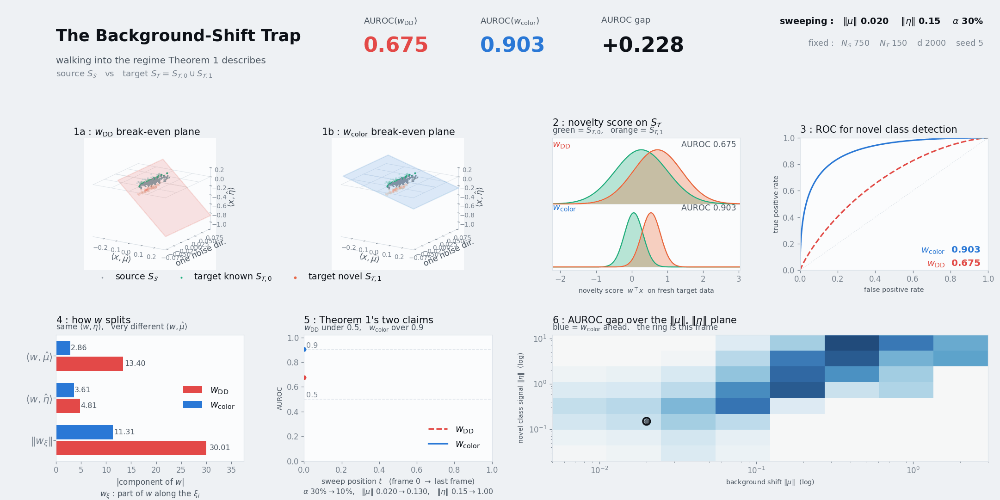

# Open-Set Domain Adaptation Under Background Shift

Official implementation of **"Open-Set Domain Adaptation Under Background Distribution Shift: Challenges and A Provably Efficient Solution"** (TMLR 2026).

Paper: <https://openreview.net/forum?id=uAJDta7VaQ>

This repository contains the code, configs, and scripts to reproduce the CIFAR-100, Amazon Reviews, and SUN397 experiments in the paper, including CoLOR and the baselines benchmarked against it (DD, uPU, nnPU, SAR-EM, BODASaito).

---

## The background-shift trap, in one animation



The linear-Gaussian example of the paper (Definition 2, eq. 2), swept from a regime with no real
separation into the one Theorem 1 describes. All seven panels stay in sync and every frame is an
exact max-margin solve:

```
alpha 30% -> 10%    ||mu|| 0.020 -> 0.130    ||eta|| 0.15 -> 1.00   (N_S=750, N_T=150, d=2000 fixed)
DD  0.675 -> 0.444          CoLOR  0.903 -> 0.938          gap  0.23 -> 0.494
```

The obvious novelty detector is a **domain discriminator**: train a classifier to tell training data
from deployment data, then call the deployment-looking points novel. Under background shift it ends up
**below chance**, while CoLOR clears **0.90** on the very same draw. Both rules recover essentially the
same novel-class signal — `<w, eta-hat>` is -0.90 against -0.89 — so the entire difference is the
background-shift direction, where the discriminator invests **-9.35** against CoLOR's **-5.47**. Forced
to separate training from deployment by a *full margin*, the cheapest direction the discriminator can
buy is the one the background shifted in, and that investment lifts *familiar* deployment points above
the novel ones, inverting the ranking. CoLOR only requires training points to sit on the correct
**side** (margin 0), so it never buys the extra lean.

### Try it yourself

**[Open the interactive simulator ▸](https://shra1-25.github.io/CoLOR/)**

The same model, solved live in your browser — no install, nothing to run. Drag the background shift
`||mu||`, the novelty strength `||eta||`, the novel-class share `alpha`, the two sample sizes and the
model capacity `d`, and both max-margin problems re-solve on every move, alongside the 3D geometry, the
score distributions, the ROC, the weight decomposition and a regime map of where each rule wins.

The page is a single self-contained HTML file with no build step and no dependencies, served from
[`docs/`](docs/) via GitHub Pages — clone the repo and open `docs/index.html` in a browser to run
the same thing offline, or edit it to change the model.

The trick that makes this possible in a browser: every reported quantity depends on the data only
through each point's two informative coordinates `<x, mu-hat>` and `<x, eta-hat>` plus the Gram matrix
of the noise orthogonal to `span{mu, eta}`, which is exactly `sigma^2 * Wishart(d-2, I_N)`. So the full
`d`-dimensional problem is simulated **without approximation** in `O(N^2)` rather than `O(N^2 d)`.
AUROC is the closed form of Lemma 2, not a sample estimate; it was checked against empirical AUROC on
200k fresh points (agreeing to 0.0003) and against an explicit `d`-dimensional solve.

> The simulator's slider ranges deliberately run far outside the region where Theorem 2's conditions
> (8)–(10) hold, so the AUROC gap can be watched opening and closing at both ends. Those conditions need
> `N_T >= 66,049` with `N_S >= N_T` — a ~142 GB Gram matrix, against 6.5 MB here — so the simulator
> demonstrates the same phenomenon in a small-`N` corner rather than verifying the bound. Panel 6 draws
> both corners on one log-log plane.

---

## Repository layout

```
CoLOR/
├── run.py                       # Hydra entry point
├── download_splits.py           # Pulls data_splits/ from Hugging Face Hub
├── environment.yaml             # Conda environment spec
├── requirements.txt             # Pip equivalents
├── config/                      # Hydra configs (datamodule, models, trainer, logger)
├── assets/                      # README media (simulation animation)
├── docs/                        # GitHub Pages site: the interactive simulator (self-contained)
├── src/                         # Library code (datamodules, algorithms, utilities)
├── models/                      # Backbone NN architectures (Resnet, Densenet, CLIP wrappers, ...)
└── scripts/                     # Reproduction shell scripts (cifar100, amazon_reviews, sun397)
```

---

## 1. Environment setup

We tested with Python 3.8 + CUDA 11.7 on Linux. Two install paths:

### Option A — conda (recommended)

```bash
conda env create -f environment.yaml
conda activate color
```

### Option B — pip / venv

```bash
python3.8 -m venv .venv
source .venv/bin/activate
pip install --upgrade pip
pip install -r requirements.txt
```

Sanity check the imports:

```bash
python -c "from src import data_utils, random_datamodule, sun397_datamodule; print('ok')"
```

---

## 2. Datasets

Each dataset has two ingredients: (i) the **raw dataset / preprocessed features**, and (ii) the **shift splits** (the source/target/train/val CSVs that simulate the background distribution shift studied in the paper). The shift splits live in `data_splits/` and are fetched separately via `download_splits.py`.

### 2.1 Splits (Hugging Face Hub)

```bash
python download_splits.py                                # all 3 datasets, default repo
python download_splits.py --datasets cifar100 sun397     # subset
python download_splits.py --output-dir /path/to/splits   # custom location
```

The default HF dataset repo is `Shravan25C/CoLOR-data-splits` (hosted by the paper authors). Each split directory is keyed `{seed}_{ood_class}_{ood_class_ratio}_{fraction_ood_class}/` and contains source/target × train/val CSVs for both `_w_shift_split.csv` and `_no_shift_split.csv` variants. Splits are bundled for seeds **0, 8, 103, 573, 1057** (the paper reports results across 8/103/573/1057).

> **Authors (uploading splits to HF).** From the repo root:
> ```bash
> huggingface-cli login
> huggingface-cli upload Shravan25C/CoLOR-data-splits ./data_splits . --repo-type dataset
> ```

### 2.2 Raw datasets / features

| Dataset        | What you need                                                                                                  | Where it lands                                                                          |
|----------------|----------------------------------------------------------------------------------------------------------------|-----------------------------------------------------------------------------------------|
| CIFAR-100      | Auto-downloaded by torchvision on first run.                                                                   | `${data_dir}/cifar100/`                                                                 |
| Amazon Reviews | Preprocessed RoBERTa features (`amazon_reviews_roberta_features.pth`) **or** the raw McAuley `*.json.gz` files. | `${data_dir}/amazon_reviews_roberta_features.pth` or `${data_dir}/amazon_reviews_tp/*` |
| SUN397         | Raw images from <https://vision.princeton.edu/projects/2010/SUN/> + precomputed CLIP / ResNet50 features.      | `${data_dir}/sun397/` plus feature `.pth` files alongside (see below)                  |

Set `data_dir` on the command line to point at wherever you keep these:

```bash
python run.py data_dir=/path/to/datasets ...
```

#### Regenerating features (optional)

The preprocessed feature files (RoBERTa features for Amazon Reviews; CLIP / ResNet50 features for SUN397) can be regenerated by running the corresponding image / text encoder once over the raw dataset and saving the resulting tensors. We recommend downloading the precomputed `.pth` artifacts from the same Hugging Face dataset repo that hosts `data_splits/` rather than recomputing from scratch.

---

## 3. Quickstart — single run

After installing the env and downloading splits:

```bash
# CIFAR-100, CoLOR, seed 8 — full paper run (max_epochs=200 by default)
python run.py \
    dataset=cifar100 datamodule=random_split_module models=precision_at_recall \
    seed=8 num_source_classes=85 fraction_ood_class=0.35 \
    ood_class=2 ood_class_ratio=0.5 use_labels=True
```

Override anything else via Hydra dotted overrides, e.g. `learning_rate=0.005 max_epochs=100 batch_size=128`.

### Verify install (1-epoch smoke test)

To confirm the pipeline runs end-to-end before launching long jobs:

```bash
python run.py \
    dataset=cifar100 datamodule=random_split_module models=precision_at_recall \
    seed=8 num_source_classes=85 fraction_ood_class=0.35 \
    ood_class=2 ood_class_ratio=0.5 use_labels=True \
    max_epochs=1 batch_size=128 \
    data_dir=/path/to/datasets \
    'hydra.run.dir=outputs/smoke_test'
```

Should finish in ~1 minute on a single GPU and print "Finished training!".

### wandb

By default `logger.offline=True` (no upload). To log to your wandb account:

```bash
python run.py logger.offline=False logger.entity=<your-entity> logger.project=<your-project> ...
```

You can also disable wandb completely with `WANDB_MODE=disabled python run.py ...`.

---

## 4. Reproducing the paper's experiments

The shell scripts under `scripts/` launch CoLOR + the five baselines across seeds `8, 103, 573, 1057` for the configurations reported in the paper.

```bash
bash scripts/run_cifar100.sh
bash scripts/run_amazon_reviews.sh
bash scripts/run_sun397.sh
```

Edit the `GPU_IDS` array inside each script to match your hardware.

---

## 5. Methods included

| Config (`models=`)                  | File                                                                          | Description |
|-------------------------------------|-------------------------------------------------------------------------------|-------------|
| `precision_at_recall`               | `src/algorithm/precision_at_recall_multiple_recalls_w_labels.py`              | **CoLOR** (this paper) |
| `sourceDiscriminator`               | `src/algorithm/sourceDiscriminator.py`                                        | DD baseline |
| `nnPU` (with `nnPU=False` for uPU)  | `src/algorithm/nnPU.py`                                                       | nnPU / uPU baselines |
| `sarem`                             | `src/algorithm/sarem.py`                                                      | SAR-EM baseline |
| `BODASaito`                         | `src/algorithm/BODASaito.py`                                                  | BODA-Saito baseline |

To add a new method, drop a new `<method>.yaml` under `config/models/` pointing at a `pytorch_lightning.LightningModule` `_target_`.

---

## 6. Key Hydra knobs

These match the symbols used in the paper's notation. Defaults are in `config/config.yaml`.

| Knob                  | Meaning                                                          |
|-----------------------|------------------------------------------------------------------|
| `dataset`             | one of `cifar100`, `amazon_reviews`, `sun397`                    |
| `arch`                | backbone (`Resnet18`, `Resnet50`, `Roberta_linear_classifier`, `CLIP_ViT-L14`, ...) |
| `seed`                | random seed; must match a split directory in `data_splits/`      |
| `num_source_classes`  | size of K (in-distribution / source classes)                     |
| `ood_class`           | which target class is treated as novel                           |
| `ood_class_ratio`     | β — fraction of novel-class samples in the target                |
| `fraction_ood_class`  | α — covariate-shift severity                                     |
| `no_shift`            | `True` to disable background covariate shift                     |
| `use_labels`          | `True` for label-aware variants of CoLOR                         |
| `target_recalls`      | list of recall levels for CoLOR's multi-recall training          |

---

## 7. Citation

```bibtex
@article{
chaudhari2026openset,
title={Open-Set Domain Adaptation Under Background Distribution Shift: Challenges and A Provably Efficient Solution},
author={Shravan S Chaudhari and Yoav Wald and Suchi Saria},
journal={Transactions on Machine Learning Research},
issn={2835-8856},
year={2026},
url={https://openreview.net/forum?id=uAJDta7VaQ},
note={}
}
```

(Replace with the final BibTeX from OpenReview's "Cite" button.)

## 8. License

See `LICENSE`.
